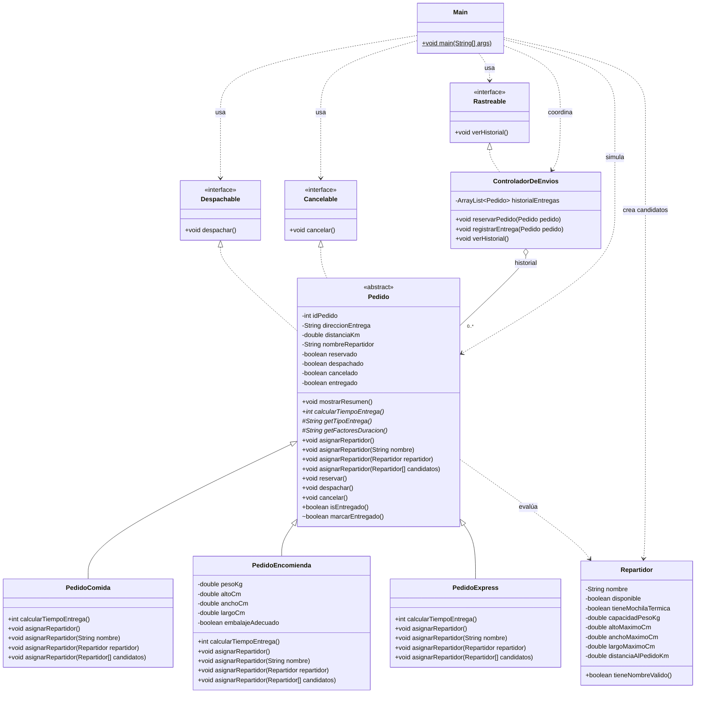

# 🛵 SpeedFast - Desarrollo Orientado a Objetos II

Proyecto de trabajo semanal para la asignatura de **Desarrollo Orientado a Objetos II**.

## 👥 Integrantes

- Javier A. Moraga Rojas

## 🎯 Actividad Sumativa 1

**Diseñando un sistema orientado a objetos con clases abstractas, polimorfismo e interfaces**

Para esta semana número 3, se construye la versión integral del sistema de entregas SpeedFast, la cual es la primera actividad sumativa. El sistema administra pedidos de comida, encomiendas y compras express, cada uno con reglas propias para calcular el tiempo de entrega y asignar un repartidor. También permite reservar, despachar, cancelar y consultar el historial de entregas mediante responsabilidades desacopladas.

## 🧩 Principios aplicados

- **Abstracción**: `Pedido` reúne los atributos y comportamientos compartidos. Implementa `mostrarResumen()` y declara `calcularTiempoEntrega()` como método abstracto.
- **Herencia**: `PedidoComida`, `PedidoEncomienda` y `PedidoExpress` extienden `Pedido` y reutilizan sus datos, estados y operaciones.
- **Sobrescritura**: cada subclase redefine `calcularTiempoEntrega()` y las variantes de `asignarRepartidor()` según sus reglas.
- **Sobrecarga**: la asignación puede ejecutarse sin parámetros, con un nombre, con un objeto `Repartidor` o con un arreglo de candidatos.
- **Polimorfismo**: `Main` manipula todos los pedidos mediante referencias `Pedido` y ejecuta el comportamiento correspondiente al tipo real.
- **Interfaces**: `Despachable`, `Cancelable` y `Rastreable` separan los contratos funcionales y son consumidas directamente por `Main`.

## 🏗️ Distribución de responsabilidades

- `Pedido` conserva el identificador, dirección, distancia, repartidor asignado y estado operativo. También protege las transiciones de reserva, despacho, cancelación y entrega.
- `PedidoComida` exige disponibilidad inmediata y mochila térmica.
- `PedidoEncomienda` valida embalaje, peso y dimensiones.
- `PedidoExpress` selecciona al repartidor disponible más cercano.
- `Repartidor` representa los datos necesarios para evaluar la asignación automática.
- `ControladorDeEnvios` coordina reservas y mantiene un `ArrayList<Pedido>` con las entregas realizadas, sin identificadores duplicados.
- `Main` construye y ejecuta los casos de demostración, sin contener reglas de negocio.

## 📐 Diagrama de clases



## ⏱️ Reglas de tiempo

- **PedidoComida**: 15 minutos base + 2 minutos por kilómetro.
- **PedidoEncomienda**: 20 minutos base + 1,5 minutos por kilómetro, redondeado al entero más cercano.
- **PedidoExpress**: 10 minutos base y 5 minutos adicionales cuando supera 5 kilómetros.

## 🖥️ Simulación incluida

1. `PedidoComida #101` se reserva, recibe una asignación automática, se despacha y se registra como entregado.
2. `PedidoEncomienda #102` se reserva, recibe una asignación manual, se despacha y se registra como entregado.
3. `PedidoExpress #103` se reserva, demuestra el rechazo de despacho sin repartidor y luego se cancela.
4. El sistema rechaza registrar el pedido cancelado y evita duplicar una entrega existente.
5. El historial final presenta solamente las dos entregas válidas y sus repartidores.

## 📋 Salida referencial

```text
--- DESPACHOS Y ENTREGAS ---

Despachando PedidoComida #101...
-> Pedido despachado correctamente por Luis Díaz.
Registrando entrega de PedidoComida #101...
-> Entrega registrada correctamente.

Despachando PedidoEncomienda #102...
-> Pedido despachado correctamente por Daniela Tapia.
Registrando entrega de PedidoEncomienda #102...
-> Entrega registrada correctamente.

--- HISTORIAL FINAL ---

Historial de entregas:
- PedidoComida #101 - entregado por Luis Díaz
- PedidoEncomienda #102 - entregado por Daniela Tapia
```

## 📁 Estructura

```text
SpeedFast/
├── README.md
├── SpeedFast.iml
└── src/
    └── main/
        └── java/
            └── speedfast/
                ├── Cancelable.java
                ├── ControladorDeEnvios.java
                ├── Despachable.java
                ├── Main.java
                ├── Pedido.java
                ├── PedidoComida.java
                ├── PedidoEncomienda.java
                ├── PedidoExpress.java
                ├── Rastreable.java
                └── Repartidor.java
```

## 🛠️ Software necesario

- **Java Development Kit (JDK) 17 LTS**.
- **IntelliJ IDEA Community o Ultimate**.

## 🚀 Ejecución

### Desde IntelliJ IDEA

1. Abrir la carpeta `SpeedFast`.
2. Configurar el proyecto con JDK 17.
3. Abrir `src/main/java/speedfast/Main.java`.
4. Ejecutar el método `main` y revisar la consola.

### Desde la terminal

```bash
javac -encoding UTF-8 -d out src/main/java/speedfast/*.java
java "-Dfile.encoding=UTF-8" -cp out speedfast.Main
```

---

📌 Proyecto académico semanal | **Duoc UC**
