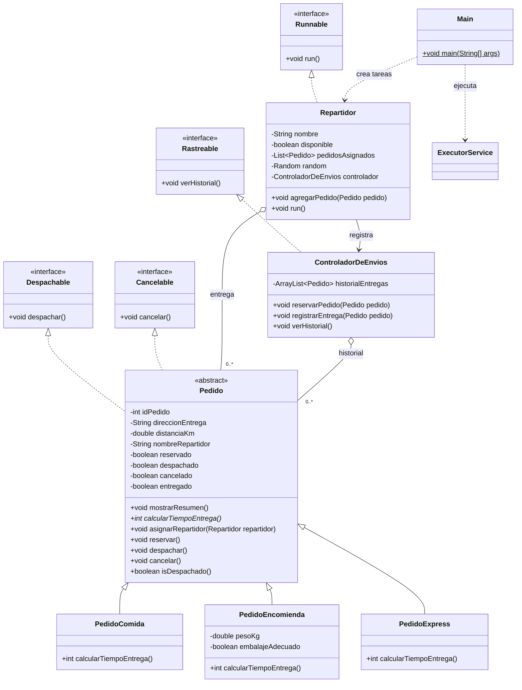

# 🛵 SpeedFast - Desarrollo Orientado a Objetos II

Proyecto de trabajo semanal para la asignatura de **Desarrollo Orientado a Objetos II**.

## 👥 Integrantes

- Javier A. Moraga Rojas

## 🎯 Actividad Formativa

**Ejecutando tareas en paralelo con hilos en Java**

Para esta semana número 4, se adapta el sistema de entregas SpeedFast para simular repartidores que procesan pedidos de forma concurrente. Cada repartidor implementa `Runnable`, el `ExecutorService` administra los hilos de ejecución y `Thread.sleep()` simula el tiempo de entrega con pausas aleatorias. Cada tarea recorre secuencialmente sus pedidos asignados e informa su avance por consola.

## 🧩 Principios aplicados

- **Abstracción**: `Pedido` reúne los atributos y comportamientos compartidos. Implementa `mostrarResumen()` y declara `calcularTiempoEntrega()` como método abstracto.
- **Herencia**: `PedidoComida`, `PedidoEncomienda` y `PedidoExpress` extienden `Pedido` y reutilizan sus datos, estados y operaciones.
- **Polimorfismo**: `Main` manipula todos los pedidos mediante referencias `Pedido` y ejecuta el comportamiento correspondiente al tipo real.
- **Interfaces**: `Despachable`, `Cancelable` y `Rastreable` separan los contratos funcionales del sistema.
- **Concurrencia**: `Repartidor` implementa `Runnable`; el `ExecutorService` lo ejecuta en un hilo de trabajo y `Thread.sleep()` simula cada traslado.
- **Ejecución paralela**: `ExecutorService` administra tres repartidores de manera simultánea y `Main` espera el término de todas las tareas.
- **Control de acceso compartido**: `ControladorDeEnvios` sincroniza el registro y la consulta del historial para evitar entregas duplicadas durante la ejecución concurrente.
- **Manejo de interrupciones**: cada repartidor captura `InterruptedException`, restaura el estado de interrupción y termina su ejecución de forma controlada.

## 🏗️ Distribución de responsabilidades

- `Pedido` conserva el identificador, dirección, distancia, repartidor asignado y estado operativo. También protege las transiciones de reserva, despacho, cancelación y entrega.
- `PedidoComida` exige disponibilidad inmediata y mochila térmica.
- `PedidoEncomienda` valida embalaje, peso y dimensiones.
- `PedidoExpress` selecciona al repartidor disponible más cercano.
- `Repartidor` representa los datos necesarios para evaluar una asignación y, como `Runnable`, entrega secuencialmente su lista de pedidos.
- `ControladorDeEnvios` coordina reservas y mantiene un `ArrayList<Pedido>` sincronizado con las entregas realizadas, sin identificadores duplicados.
- `Main` prepara los pedidos, reservas y asignaciones; luego ejecuta tres repartidores mediante un `ExecutorService`.

## 📐 Diagrama de clases



## ⏱️ Reglas de tiempo

- **PedidoComida**: 15 minutos base + 2 minutos por kilómetro.
- **PedidoEncomienda**: 20 minutos base + 1,5 minutos por kilómetro, redondeado al entero más cercano.
- **PedidoExpress**: 10 minutos base y 5 minutos adicionales cuando supera 5 kilómetros.
- **Simulación concurrente**: cada entrega usa una pausa aleatoria entre 500 y 1499 milisegundos para representar el recorrido del repartidor.

## 🖥️ Simulación incluida

1. Se crean seis pedidos: dos de comida, dos encomiendas y dos compras express.
2. Los pedidos se reservan y reciben un repartidor válido antes de comenzar la simulación.
3. Ana, Luis y Carla reciben dos pedidos cada uno.
4. Un `ExecutorService` con tres hilos ejecuta los tres repartidores en paralelo.
5. Cada repartidor despacha, simula el traslado y registra sus pedidos secuencialmente.
6. El historial final se consulta solamente después de que las tres tareas terminan.

## 📋 Salida referencial

El orden entre repartidores puede variar en cada ejecución debido a la concurrencia, pero cada repartidor conserva el orden de sus propios pedidos.

```text
--- ENTREGAS CONCURRENTES ---

[Repartidor Ana] inicia -> PedidoComida #101
[Repartidor Luis] inicia -> PedidoEncomienda #102
[Repartidor Carla] inicia -> PedidoExpress #103
[Repartidor Ana] en ruta -> PedidoComida #101 (823 ms)
Registrando entrega de PedidoComida #101...
-> Entrega registrada correctamente.
[Repartidor Ana] finaliza -> PedidoComida #101

--- HISTORIAL FINAL ---

Historial de entregas:
- PedidoComida #101 - entregado por Ana
- PedidoEncomienda #102 - entregado por Luis
- PedidoExpress #103 - entregado por Carla
```

## 📁 Estructura

```text
Semana 4/
├── README.md
├── S4_ Instrucciones y pauta de evaluación.docx
├── SpeedFast.iml
└── src/
    └── main/
        └── java/
            └── speedfast/
                ├── Cancelable.java
                ├── ControladorDeEnvios.java
                ├── Despachable.java
                ├── Main.java
                ├── Pedido.java
                ├── PedidoComida.java
                ├── PedidoEncomienda.java
                ├── PedidoExpress.java
                ├── Rastreable.java
                └── Repartidor.java
```

## 🛠️ Software necesario

- **Java Development Kit (JDK) 17 LTS**.
- **IntelliJ IDEA Community o Ultimate**.

## 🚀 Ejecución

### Desde IntelliJ IDEA

1. Abrir la carpeta `Semana 4`.
2. Configurar el proyecto con JDK 17.
3. Abrir `src/main/java/speedfast/Main.java`.
4. Ejecutar el método `main` y revisar la consola.

### Desde la terminal

```bash
javac -encoding UTF-8 -d out src/main/java/speedfast/*.java
java "-Dfile.encoding=UTF-8" -cp out speedfast.Main
```

---

📌 Proyecto académico semanal | **Duoc UC**
